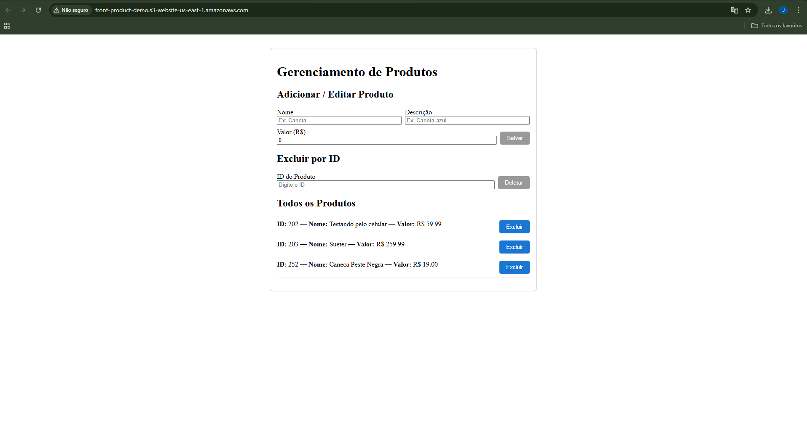

# Projeto de Estudo AWS com Spring Boot e Angular

Este é um projeto básico para estudo dos principais serviços da AWS, composto por:

- **Backend:** Spring Boot  
  - Implantado no **Elastic Beanstalk**  
  - Conecta-se a um banco **MySQL** hospedado no **Amazon RDS**
- **Frontend:** Angular  
  - Build estático hospedado no **Amazon S3** (site estático)
- **CI/CD:**  
  - Pipelines configuradas com **GitHub Actions** para build, testes e deploy automático no Elastic Beanstalk

## Serviços AWS Utilizados

| Serviço              | Descrição                                      |
|----------------------|------------------------------------------------|
| Amazon RDS (MySQL)   | Banco de dados relacional gerenciado           |
| Elastic Beanstalk    | Plataforma PaaS para deploy do Spring Boot     |
| Amazon S3            | Armazenamento estático para o frontend         |
| GitHub Actions       | Automação de build, testes e deploy contínuo   |

> **Observação:**  
> Projeto simples criado apenas para explorar o fluxo de deploy, configuração dos serviços AWS e integração contínua via GitHub Actions.

---

